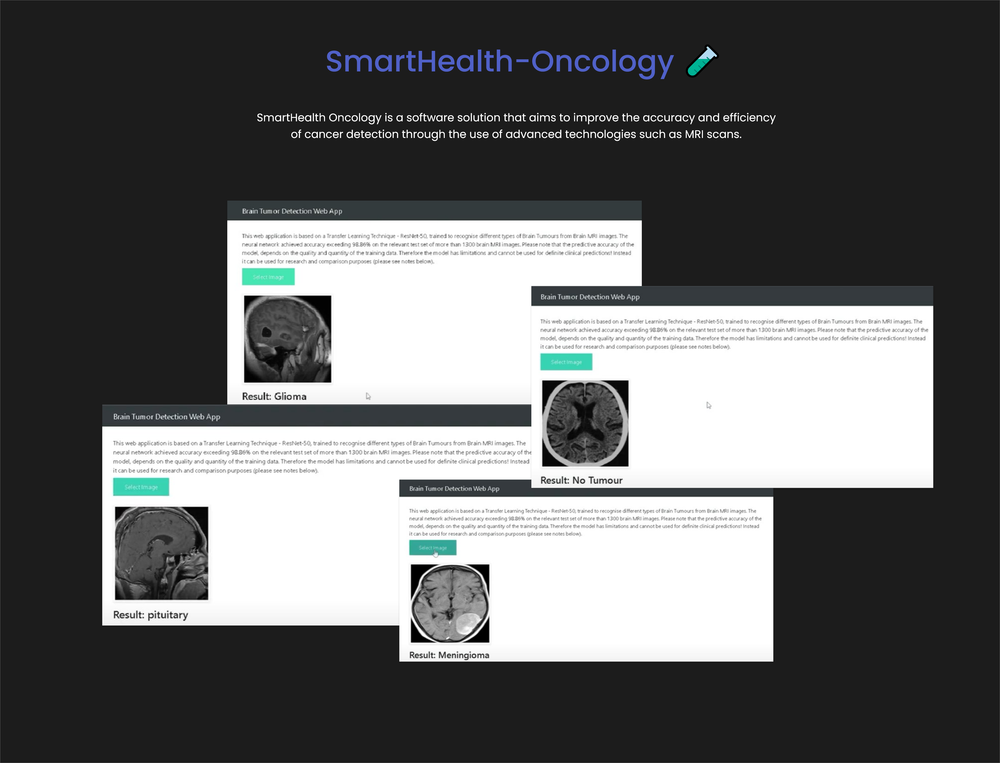

# SmartHealth-Oncology 🧪
```
SmartHealth Oncology is a software solution that aims to improve the accuracy and efficiency 
of cancer detection through the use of advanced technologies such as MRI scans. 

The system utilizes machine learning algorithms to analyze MRI images and provide highly 
accurate and detailed reports on potential cancerous lesions.

With SmartHealth Oncology, medical professionals can quickly and accurately diagnose cancer 
in patients, enabling faster treatment and better patient outcomes. The system also allows 
for easy tracking and monitoring of patients throughout their treatment journey, making it 
an essential tool for oncology departments and healthcare providers.
```

<div float="right" width="800" height="700">
  
</div>
